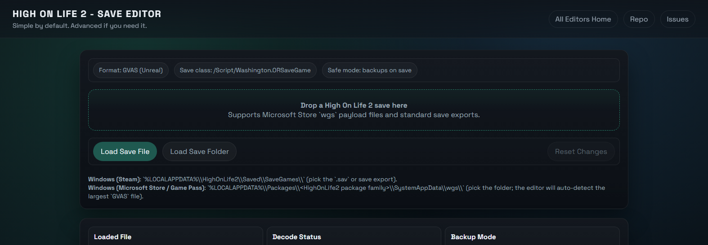

# High On Life 2 - Save Editor

A practical save editor for High On Life 2 that decodes the GVAS save into readable fields and safely re-encodes after edits.

Use editor without downloading [HERE](https://saveeditors.github.io/high-on-life-2-save-editor/)

All editors homepage: [https://saveeditors.github.io/](https://saveeditors.github.io/)

Have a request for a new save editor? [Request it here!](https://whispermeter.com/message-box/15b6ac70-9113-4e9c-b629-423f335c7e07)

## What You Can Edit Right Now

- Money (raw units; key `Inventory.Descriptor.Item.Pesos`).
- Checkpoint name (story progression) using the existing `Checkpoint.*` keys.
- Mission and objective flags from `DictionaryRaw` (group filter + search).
- Inventory and item counts when present in `DictionaryRaw` (auto-filtered inventory keys).
- Player/stat and weapon/upgrade keys when present (auto-filtered).
- Checkpoint state flags from `Dictionary` (`EState::Active` / `EState::Inactive`).

## Not Confirmed / Not Exposed Yet

- The `CharacterInventory` byte array inside `SpawnedObjectDatas` is preserved byte-for-byte and not edited directly yet.
- Any GUID-heavy or opaque internal IDs are intentionally hidden.
- Early intro saves may only show Pesos + mission flags. Mid-game saves are needed to populate inventory, weapons, and player stats.
- Additional economy fields beyond Pesos are shown when present but not guaranteed to map to visible in-game systems.

## Quick Start (PowerShell)

Run from this folder:

- Browser mode: `./Start-HighOnLife2SaveEditor.ps1 -Mode web`
- Electron mode: `./Start-HighOnLife2SaveEditor.ps1 -Mode electron`
- Build portable EXE: `./Start-HighOnLife2SaveEditor.ps1 -Mode build`

Optional:

- Change port: `./Start-HighOnLife2SaveEditor.ps1 -Mode web -Port 9000`
- Do not auto-open browser: `./Start-HighOnLife2SaveEditor.ps1 -Mode web -NoOpen`

## Save Paths (Windows)

- Steam (likely): `%LOCALAPPDATA%\HighOnLife2\Saved\SaveGames\`
- Game Pass / Microsoft Store: `%LOCALAPPDATA%\Packages\<HighOnLife2 package family>\SystemAppData\wgs\`

## Notes

- Web mode cannot overwrite original files. Use the provided downloads.
- Desktop mode always writes a `.bakN` backup beside the original before overwriting.
- Close the game and cloud sync before editing; relaunch after saving.
